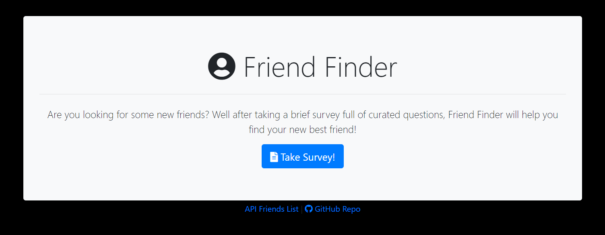
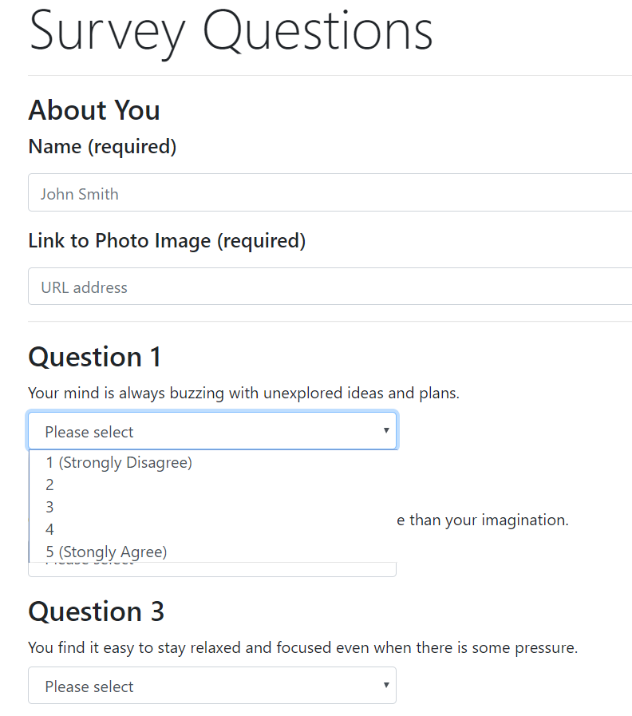
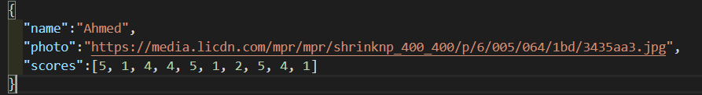

# Friend Finder
Friend Finder is designed to be an application allowing anyone to fill out a brief survey and cross compare their answers with other people in the database to find the person who is the closest match.

### Live Link: https://aj-friendfinder.herokuapp.com/

This application is simple to use! After clicking on the take survey button, you will be taken to another page that has a series of ten questions which will give Friend Finder points of reference to use to find someone in our database that closely matches your scores.  After hitting submit you'll be immediately prompted with your match! Quick and easy.

## Design Instructions
- Designing an app with modularity in mind where there are separate files for the server, routing, stored data and HTML pages
- Using Express to handle routing
- Using Heroku as a platform to host the live server
- Create a series of ten questions in a form with a drop-down answer option that scale from 1-5
- Calculate compatability utilizing these scores and giving the user back their match
- Storing user's data locally to the server for future use (** THIS DATA IS WIPE AFTER SERVER RESTARTS **)

## Technologies Used
- JavaScript/jQuery
- HTML
- Bootstrap
- CSS
- Express.js
- Node.js
- Heroku

> Example of how data is set up in `friends.js`

## Improvement Wish List
- Updated Design for landing page and survey page
- Re-designing the survey questions to take in an array of questions and appending them to the survey, for ease of add/removing/changing
- Adding static routing